# Functa

This repository contains code for the ICML 2022 paper
["From data to functa: Your data point is a function and you can treat it like
one"](https://arxiv.org/abs/2201.12204) by Emilien Dupont*, Hyunjik Kim*,
Ali Eslami, Danilo Rezende and Dan Rosenbaum. *Denotes joint first authorship.

The codebase contains the meta-learning experiment for CelebA-HQ-64 and
SRN CARS, along with a colab that creates a modulation dataset for
CelebA-HQ-64.

## Setup

To set up a Python virtual environment with the required dependencies, run:
```shell
# create virtual environment
python3 -m venv /tmp/functa_venv
source /tmp/functa_venv/bin/activate
# update pip, setuptools and wheel
pip3 install --upgrade pip setuptools wheel
# install all required packages
pip3 install -r requirements.txt
```

Note that the directory containing this repository must be included in the
`PYTHONPATH` environment variable. This can be done by e.g.,
```shell
export PYTHONPATH=DIR_CONTAINING_FUNCTA
```

Once done with virtual environment, deactivate with command:
```shell
deactivate
```
then delete venv with command:
```shell
rm -r /tmp/functa_venv
```

## Setup celeb_a_hq_custom dataset as Tensorflow dataset (TFDS)
The publicly available celeb_a_hq dataset with TFDS at
https://www.tensorflow.org/datasets/catalog/celeb_a_hq
requires manual preparation, for which there are some known issues:
https://github.com/tensorflow/datasets/issues/1496.
Alternatively, there exist [zip files](https://drive.google.com/corp/drive/folders/11Vz0fqHS2rXDb5pprgTjpD7S2BAJhi1P)
that are publicly available for download.
We convert the 128x128 resolution version into a tensorflow dataset (TFDS)
so that we can readily load the data into our jax/haiku models with various
data processing options that come with tfds.
Note that the resulting dataset has a different ordering to the tfds version,
hence any train/test split further down the line may be different to the one
used in our paper, and the downsampling algorithm used may be different.
We use `tf.image.resize` to resize to 64x64 resolution with the default biliear
interpolation here.

To set up the tfds, run:
```shell
cd celeb_a_hq_custom
tfds build --register_checksums
```
This should be quick to run (few seconds).

## Setup srn_cars dataset as Tensorflow dataset (TFDS) (Optional)
The publicly available srn_cars dataset exists as a [zip file](https://drive.google.com/corp/drive/folders/1PsT3uKwqHHD2bEEHkIXB99AlIjtmrEiR)
in the official [PixelNeRF codebase](https://github.com/sxyu/pixel-nerf).
We convert this into a tensorflow dataset (tfds) so that we can readily load the
data into our jax/haiku models with various data processing options that come
with tfds.

To set up the tfds, run:
```shell
cd srn_cars
tfds build --register_checksums
```
This can take a while to run (~ 1hr) as we convert views of each scene into an
array with shape (num_views, H, W, C), so set it running and enjoy some :coffee:

## Run tests (Optional)
After setting up either dataset, check that you can successfully run a single
step of the experiment by running the test for celeb_a_hq:
```shell
python3 -m test_celeb_a_hq
```
or for srn_cars:
```shell
python3 -m test_srn_cars
```

## Run meta-learning experiment
Set the hyperparameters in `experiment_meta_learning.py` as desired by modifying
the config values. Then inside the virtual environement, run the
[JAXline](https://github.com/deepmind/jaxline) experiment via command:
```shell
python3 -m experiment_meta_learning
```

## Download pretrained weights
Download pretrained weights for the CelebA-HQ-64 meta-learning experiments
for `mod_dim=64, 128, 256, 512, 1024` and srn_cars with `mod_dim=128` here:
|Dataset| Modulation Dimension | Link |
|:---:|:---:|:---:|
|CelebA-HQ-64| 64 | [.npz](https://storage.googleapis.com/dm-functa/celeba_params_64_latents.npz)|
|CelebA-HQ-64| 128 | [.npz](https://storage.googleapis.com/dm-functa/celeba_params_128_latents.npz)|
|CelebA-HQ-64| 256 | [.npz](https://storage.googleapis.com/dm-functa/celeba_params_256_latents.npz)|
|CelebA-HQ-64| 512 | [.npz](https://storage.googleapis.com/dm-functa/celeba_params_512_latents.npz)|
|CelebA-HQ-64| 1024 | [.npz](https://storage.googleapis.com/dm-functa/celeba_params_1024_latents.npz)|
|SRN CARS| 128 | [.npz](https://storage.googleapis.com/dm-functa/srn_cars_params_128_latents.npz)|

Note that the weights for CelebA-HQ-64 were obtained using the original tfds
dataset, so they can be slightly different to the ones resulting from running
the above meta-learning experiment with the custom celeb_a_hq dataset.

How to load these weights into the model is shown in the demo Colab below.

## Create or Download modulations for CelebA-HQ-64
`modulation_dataset_writer.py` creates the modulations on celeba as npz.
Before running, make sure the pretrained weights for the correct modulation dim
have been downloaded. Then use `mod_dim` and `pretrained_weights_dir` as input
args to the python script. Optionally also specify `save_to_dir` to store the
created modulations as npz in a different directory than the directory
you are running from. Run via command:
```shell
python3 -m modulation_dataset_writer \
  --mod_dim=64 \
  --pretrained_weights_dir=DIR_CONTAINING_PRETRAINED_WEIGHTS \
  --save_to_dir=DIR_TO_SAVE_MODULATION_DATASET
```
Alternatively, download the modulations here:
|Modulation Dimension| Link |
|:---:|:---:|
| 64 | [.npz](https://storage.googleapis.com/dm-functa/celeba_modulations_64_latents.npz)|
| 128 | [.npz](https://storage.googleapis.com/dm-functa/celeba_modulations_128_latents.npz)|
| 256 | [.npz](https://storage.googleapis.com/dm-functa/celeba_modulations_256_latents.npz)|
| 512 | [.npz](https://storage.googleapis.com/dm-functa/celeba_modulations_512_latents.npz)|
| 1024 | [.npz](https://storage.googleapis.com/dm-functa/celeba_modulations_1024_latents.npz)|

Again note that these modulations were obtained using the original tfds
dataset, so they can be slightly different to the ones resulting from running
the above script that uses the custom celeb_a_hq dataset.

## Demo Colab [](https://colab.research.google.com/github/deepmind/functa/blob/main/modulation_visualization_colab.ipynb)
We also include a colab that shows how to visualize modulation reconstructions
for CelebA-HQ-64.

# Paper Figures
## Figure 4
Meta-learned initialization + 4 gradient steps and target for test scene.
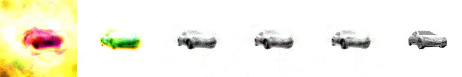

## Figure 7
Course of optimization for imputation of voxel from partial observation.

### From back
Partial observation    |  Imputation
:---------------------:|:---------------------:
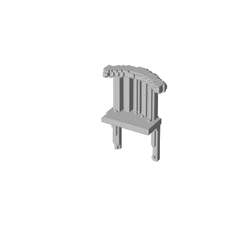  |  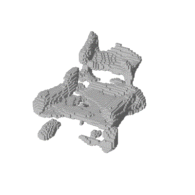

### From front
Partial observation    |  Imputation
:---------------------:|:---------------------:
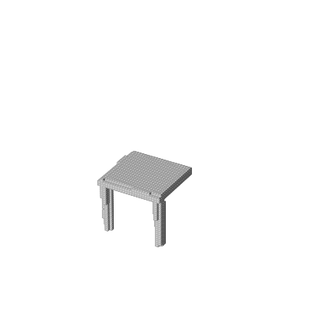  |  

### From left
Partial observation    |  Imputation
:---------------------:|:---------------------:
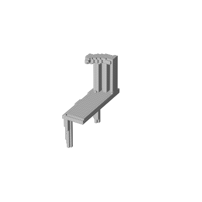  |  

### From lidar scan
Partial observation    |  Imputation
:---------------------:|:---------------------:
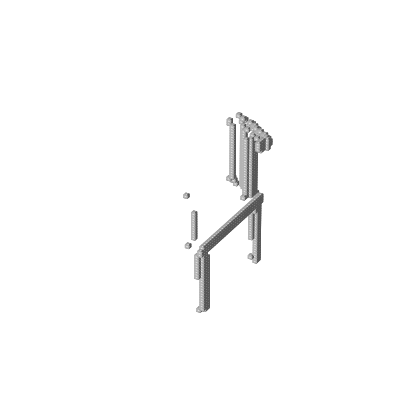  |  


## Figure 9
Uncurated samples from DDPM (diffusion) trained on 64-dim modulations of SRN-cars.


## Figure 10
Latent interpolation between two car scenes with moving pose.


## Figure 11
Novel view synthesis from occluded view.
Occluded view        |  Ground truth       |Inferred             | No prior
:-------------------:|:-------------------:|:-------------------:|:-------------------:
 | 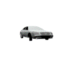 | | 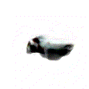


## Figure 12
Uncurated samples from flow trained on 256-dim modulations on ERA-5 temperature data.


## Figure 26
Additional voxel imputation results.
Partial observation    |  Imputation
:---------------------:|:---------------------:
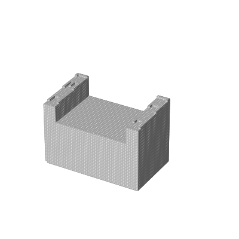  |  
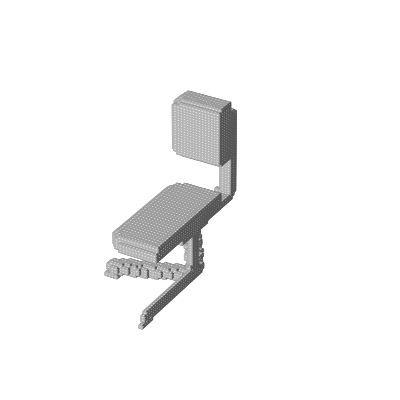  |  
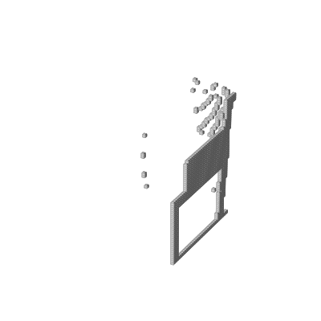  |  
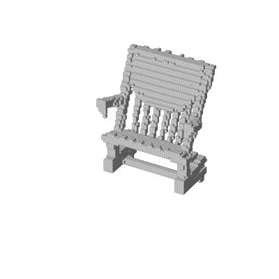  |  

## Figure 28
Additional novel view synthesis results.
Occluded view        |  Ground truth       |Inferred             | No prior
:-------------------:|:-------------------:|:-------------------:|:-------------------:
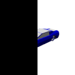 | 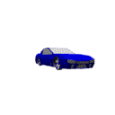 | | 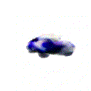
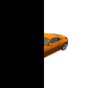 | 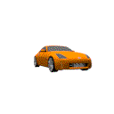 | | 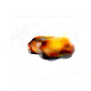
 |  | | 
 |  | | 


## Giving Credit

If you use this code in your work, we ask you to please cite our work:
```
@InProceedings{functa22,
  title = {From data to functa: Your data point is a function and you can treat it like one},
  author = {Dupont, Emilien and Kim, Hyunjik and Eslami, S. M. Ali and Rezende, Danilo Jimenez and Rosenbaum, Dan},
  booktitle = {39th International Conference on Machine Learning (ICML)},
  year = {2022},
}
```
## Raising Issues

Please feel free to raise a GitHub issue.

## License and disclaimer

Copyright 2022 DeepMind Technologies Limited

All software is licensed under the Apache License, Version 2.0 (Apache 2.0);
you may not use this file except in compliance with the Apache 2.0 license.
You may obtain a copy of the Apache 2.0 license at:
https://www.apache.org/licenses/LICENSE-2.0

All other materials are licensed under the Creative Commons Attribution 4.0
International License (CC-BY). You may obtain a copy of the CC-BY license at:
https://creativecommons.org/licenses/by/4.0/legalcode

Unless required by applicable law or agreed to in writing, all software and
materials distributed here under the Apache 2.0 or CC-BY licenses are
distributed on an "AS IS" BASIS, WITHOUT WARRANTIES OR CONDITIONS OF ANY KIND,
either express or implied. See the licenses for the specific language governing
permissions and limitations under those licenses.

This is not an official Google product.
